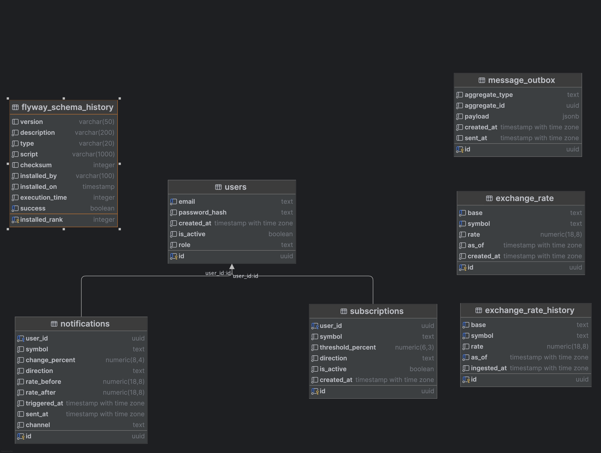
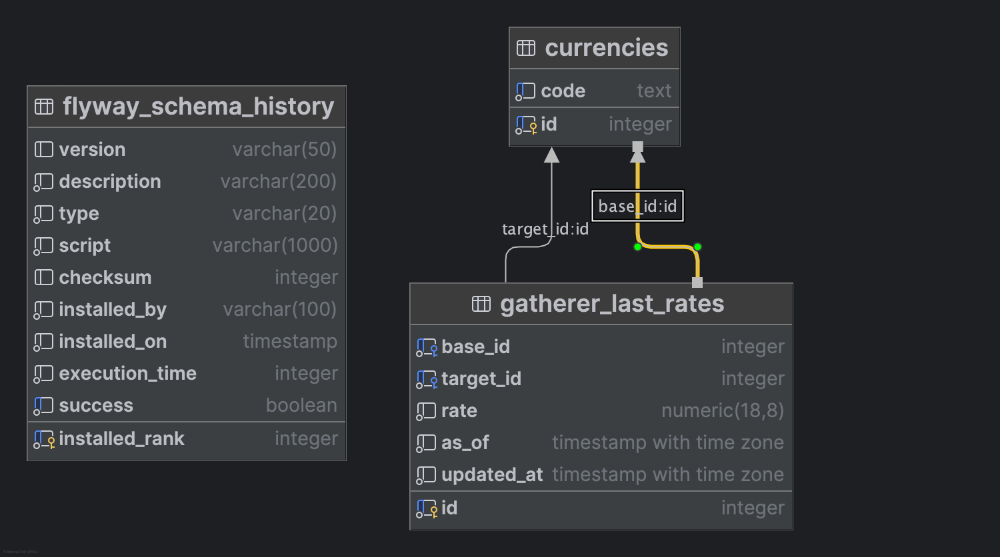

# Alarm Walutowy

Monorepo mikroserwisowej aplikacji do monitorowania kursów walut i powiadamiania użytkowników o istotnych zmianach.

---

## Spis treści

* [Cel projektu](#cel-projektu)
* [Architektura](#architektura)
* [Uruchomienie lokalne (Docker Compose)](#uruchomienie-lokalne-docker-compose)
* [Wybór technologii](#wybór-technologii)
* [Wymagania funkcjonalne](#wymagania-funkcjonalne)
* [Model domeny i schemat danych](#model-domeny-i-schemat-danych)
* [Kontrakty komunikacji](#kontrakty-komunikacji)
* [API DataProvider (REST)](#api-dataprovider-rest)
* [Konfiguracja i zmienne środowiskowe](#konfiguracja-i-zmienne-środowiskowe)
* [Bezpieczeństwo](#bezpieczeństwo)
* [Monitoring i logowanie](#monitoring-i-logowanie)
* [Testy](#testy)
* [CI/CD](#cicd)
* [Plan wdrożenia / Roadmapa](#plan-wdrożenia--roadmapa)
* [FAQ dla deweloperów](#faq-dla-deweloperów)

---

## Cel projektu

„Alarm Walutowy” dostarcza w (niemal) czasie rzeczywistym informacje o zmianach kursów walut oraz wysyła powiadomienia, gdy zmiana przekroczy zadany próg procentowy skonfigurowany przez użytkownika.

---

## Architektura

Dwa mikroserwisy + infrastruktura wspólna.

```
┌──────────────────┐      ┌────────────────────┐
│  Zewn. dostawcy  │      │  DataGatherer      │
│  kursów (API)    │──▶──▶│  (scheduler + MQ)  │
└──────────────────┘      └─────────┬──────────┘
                                     │
                                RabbitMQ (MQ)
                                     │
                            ┌─────────▼──────────┐
                            │   DataProvider     │
                            │ (REST + consumer)  │
                            └─────────┬──────────┘
                                      │
                         PostgreSQL    │     Mail (SMTP)
                                      ▼
                                 Klienci (REST)
```

* **DataGatherer** – cyklicznie odpytuje wybrane API kursów (plan: co 1 h) i przy istotnych zmianach publikuje komunikat do kolejki.
* **DataProvider** – konsumuje komunikaty, zapisuje dane do bazy, zarządza użytkownikami/subskrypcjami, wystawia REST API i wysyła e‑maile.
* **Brak widoków** – wyłącznie REST API.

---

---

## Uruchomienie lokalne (Docker Compose)
Uzupełnij plik `.env` w katalogu `infra/` (na podstawie `.env.example`).

Aby uzyskać klucz do API Open Exchange Rates, zapoznać się z instrukcją https://docs.openexchangerates.org/reference/authentication.

Uruchomienie:

```bash
cd infra && docker compose up -d --build
# DataProvider -> http://localhost:8080/swagger-ui.html
# RabbitMQ UI -> http://localhost:15672 (guest/guest)
# MailHog UI -> http://localhost:8025
```


## Wybór technologii

Poniżej rekomendowana (spójna) ścieżka w Javie. Alternatywy wskazane kursywą.

**Język/Frameworki**

* Java 21, **Spring Boot 3.3+** (Security, Web, Validation, AMQP, Data JPA, Mail)
* Konsument/producent MQ: **RabbitMQ** (AMQP 0.9.1) *(alternatywnie: Kafka)*
* Baza danych: **PostgreSQL 15**
* Migracje schematu: **Flyway**
* Dokumentacja API: **springdoc-openapi** (Swagger UI)
* JWT: **Spring Security + jjwt**
* Harmonogram: **Spring Scheduling** *(lub Quartz)*
* E‑mail: **Spring Mail + MailHog (dev)** *(prod: dowolny SMTP)*
* Build: **Maven** *(lub Gradle)*
* Konteneryzacja: **Docker / Docker Compose**
* Observability: **Micrometer + Prometheus + Grafana**, logi w **JSON**

Struktura repo (monorepo):

```
/infra/                # docker-compose, pliki konfig.
/data-gatherer/        # Spring Boot app (producer)
/data-provider/        # Spring Boot app (consumer + REST)
/docs/                 # diagramy, ADR, OpenAPI
```

---

## Wymagania funkcjonalne

### DataGatherer

* **Pobieranie danych**: harmonogram co 1h (cron `0 0 * * * *`), zapytania do wybranego dostawcy (np. Open Exchange Rates).
* **Analiza zmian**: porównanie ostatniego znanego kursu z nowym; jeśli `|Δ%| ≥ próg_globalny` lub kurs dotyczy aktywnego instrumentu – publikacja do MQ.
* **Wiadomość**: zawiera co najmniej `base`, `symbol`, `rate`, `timestamp_source`.

### DataProvider

* **Konsumpcja danych**: zapis do tabel `exchange_rate` i `exchange_rate_history` z idempotencją (deduplikacja po `symbol+timestamp`).
* **Użytkownicy**: rejestracja/logowanie, JWT, role `USER`/`ADMIN`.
* **Subskrypcje**: CRUD subskrypcji (`symbol`, `threshold_percent`, `direction` [UP/DOWN/ANY]).
* **Powiadomienia**: e‑mail przy przekroczeniu progu; możliwość `digest daily` i `instant`.
* **API publiczne**: odczyt aktualnych kursów i historii.

---

## Model domeny i schemat danych

Schemat relacyjny (PostgreSQL):

* `data_provider`



* `data_gatherer`


---

## Kontrakty komunikacji

### Wiadomość z DataGatherer → MQ → DataProvider (JSON)

```json
{
  "event": "EXCHANGE_RATE_CHANGED",
  "base": "USD",
  "symbol": "PLN",
  "rate": 3.9876,
  "timestamp_source": "2025-09-25T10:00:00Z",
  "provider": "openexchangerates",
  "trace_id": "c7b3f4c2-..."
}
```

Nagłówki AMQP (zalecane): `content-type: application/json`, `message-id`, `x-trace-id`, `x-dedup-key = base|symbol|timestamp_source`.

Idempotencja po `base+symbol+timestamp_source`.

---

## API DataProvider (REST)

Dokumentacja w Swagger UI: `/swagger-ui.html` (springdoc-openapi).

### Autoryzacja

`Authorization: Bearer <JWT>` dla endpointów chronionych.

### Endpoints (skrót)

```
POST   /api/v1/auth/register         # rejestracja
POST   /api/v1/auth/login            # zwrot JWT
GET    /api/v1/rates                 # aktualne kursy (query: base, symbols[])
GET    /api/v1/rates/{base}/{symbol}/history?from=&to=&limit=

GET    /api/v1/subscriptions         # lista moich subskrypcji
POST   /api/v1/subscriptions         # {symbol, threshold_percent, direction}
PATCH  /api/v1/subscriptions/{id}    # modyfikacja
DELETE /api/v1/subscriptions/{id}    # usunięcie

POST   /api/v1/notifications/test    # wysyłka testowa (dla zalog.
                                     # użytkownika) – środ.
```

### Kody błędów (przykłady)

* `400` – walidacja, niepoprawne parametry
* `401` – brak/niepoprawny JWT
* `403` – brak uprawnień
* `404` – nie znaleziono
* `409` – konflikt (duplikat subskrypcji)
* `429` – rate limit
* `500` – błąd serwera

### Przykładowe żądania

```bash
# rejestracja
curl -X POST http://localhost:8080/api/v1/auth/register \
  -H 'Content-Type: application/json' \
  -d '{"email":"alice@example.com","password":"S3cret!pass"}'

# logowanie
curl -X POST http://localhost:8080/api/v1/auth/login \
  -H 'Content-Type: application/json' \
  -d '{"email":"alice@example.com","password":"S3cret!pass"}'

# dodanie subskrypcji (Authorization: Bearer <JWT>)
curl -X POST http://localhost:8080/api/v1/subscriptions \
  -H 'Content-Type: application/json' -H 'Authorization: Bearer <JWT>' \
  -d '{"symbol":"EUR/PLN","threshold_percent":1.5,"direction":"ANY"}'
```


---

## Konfiguracja i zmienne środowiskowe

---

## Bezpieczeństwo

* **JWT** dla autoryzacji, rotacja sekretu (env per środowisko), krótkie TTL + refresh (opcjonalnie).
* **Rate limiting** (np. Bucket4j) na endpointach publicznych.
* **Walidacja** payloadów (Jakarta Validation), sanity‑check dla `symbol`.
* **Sekrety** poza repo (env / secret manager).
* **TLS** (prod za ingress/proxy), HSTS, CORS whitelist.
* **Idempotencja** konsumenta MQ + deduplikacja.

---

## Monitoring i logowanie

* **Micrometer** → Prometheus (metryki: czas pobierania, opóźnienia MQ, liczba notyfikacji, błędy 4xx/5xx).
* **Grafana** – dashboardy usług.
* Logi strukturalne (JSON), korelacja `trace_id` z MQ → REST.

---

## Testy

* **Jednostkowe**: JUnit 5 + Mockito (serwisy, walidacja).
* **Integracyjne**: Spring Boot Test + Testcontainers (Postgres, RabbitMQ).
* **Kontraktowe**: Spring Cloud Contract (DataGatherer ↔ DataProvider, REST API ↔ klienci).
* **End‑to‑end (opcjonalnie)**: scenariusze Gherkin (Cucumber).

Przykładowy scenariusz e2e:

1. Rejestracja użytkownika i logowanie.
2. Utworzenie subskrypcji `EUR/PLN, 1.5%, ANY`.
3. Wysłanie do MQ komunikatu z `Δ% = 2%`.
4. Sprawdzenie, że e‑mail trafił do MailHog i zapisano rekord w `notifications`.

---

## CI/CD

* **CI**: GitHub Actions/ GitLab CI – kroki: build, test, kontrakty, obrazy Docker, skany (OWASP Dependency‑Check, Trivy).
* **CD**: push obrazów do rejestru, deployment na środowiska (Helm chart dla K8s lub ECS), migracje Flyway on‑startup.
* Tagowanie wersji: `vMAJOR.MINOR.PATCH`, migracje `V__*.sql`.

---

## Plan wdrożenia / Roadmapa

**Milestone 1 – Szkielet projektu** (1–2 dni)

* Monorepo, moduły, Docker Compose, puste aplikacje Spring Boot, health‑checki.
* Konfiguracja RabbitMQ, Postgres, MailHog.

**Milestone 2 – Autoryzacja i użytkownicy** (2–3 dni)

* Rejestracja/logowanie, JWT, testy.

**Milestone 3 – Subskrypcje + modele danych** (2–3 dni)

* Tabele, CRUD, walidacja, ograniczenia unikalności, testy repozytoriów.

**Milestone 4 – Integracja MQ i historia kursów** (3–4 dni)

* Konsumpcja komunikatów, idempotencja, zapis historii, metryki.

**Milestone 5 – DataGatherer (scheduler + provider)** (3–4 dni)

* Klient HTTP do dostawcy, harmonogram, logika progów, publikacja MQ.

**Milestone 6 – Powiadomienia** (2–3 dni)

* Reguły triggerów, e‑maile, MailHog, preferencje kanału (na start: EMAIL), testy e2e.

**Milestone 7 – Twardnienie i obserwowalność** (2 dni)

* Rate limiting, dashboardy, alerty, cleanup.

---

## FAQ dla deweloperów

* **Skąd kurs bazowy?** Trzymamy `base=USD` (konfigurowalne); pary raportujemy jako `BASE/SYMBOL`, np. `USD/PLN`.
* **Ile API dostawców?** Na start jeden (Open Exchange Rates). Interfejs `RateProvider` umożliwia dołączanie kolejnych (NBP, ECB) z fallbackiem.
* **Czy potrzebny cache?** W DataProvider można dodać krótki cache GET (`/rates`) na 30–60 s (Caffeine), by odciążyć DB.
* **Czy potrzebny outbox?** Przy wzroście ruchu tak – ułatwia niezawodną wysyłkę wieloma kanałami (e‑mail/SMS/push).

---

## Załączniki

* `/docs/openapi.yaml` – definicja API (do uzupełnienia w trakcie prac).
* Diagramy C4/Sequence (PlantUML / draw.io) – opcjonalnie.
