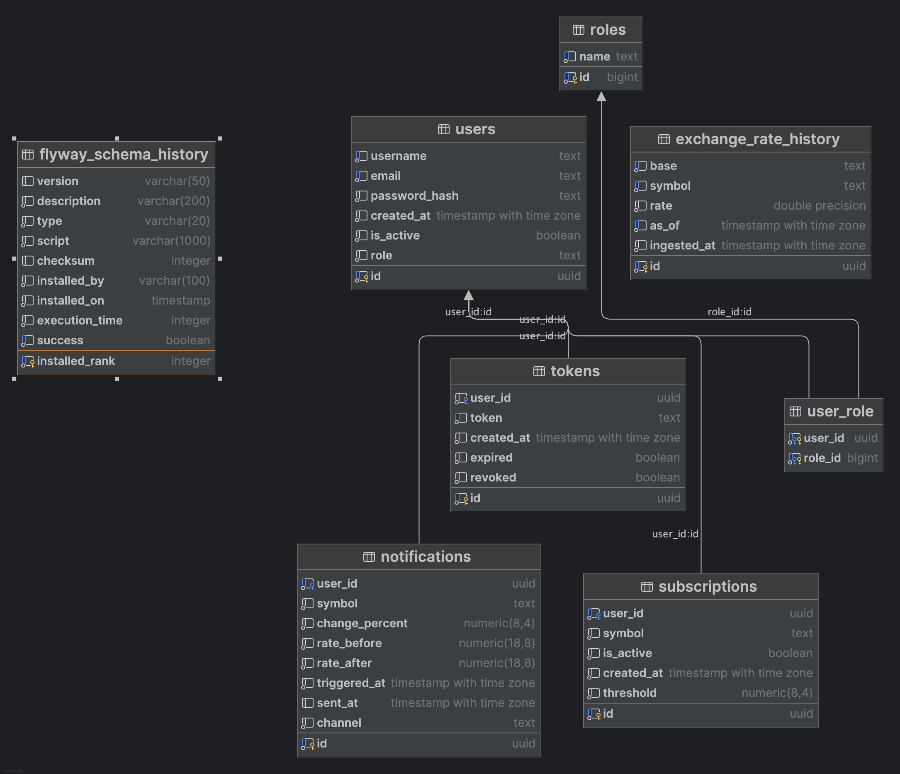
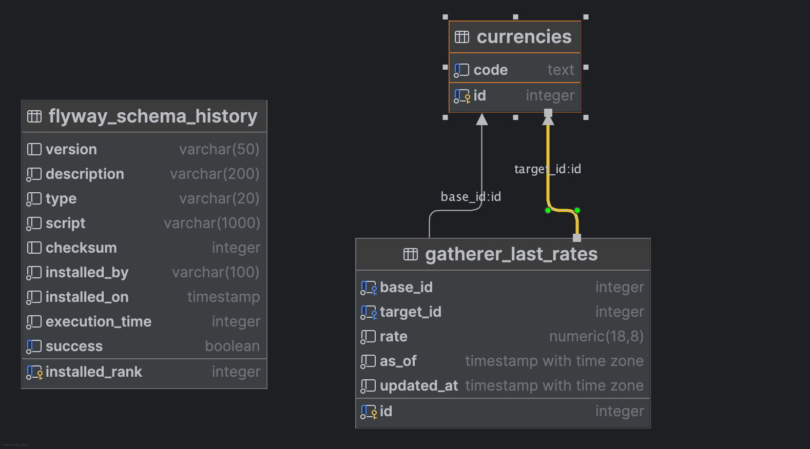

# Alarm Walutowy

Monorepo mikroserwisowej aplikacji do monitorowania kursów walut i powiadamiania użytkowników o istotnych zmianach.

---

## Spis treści

* [Cel projektu](#cel-projektu)
* [Architektura](#architektura)
* [Uruchomienie lokalne (Docker Compose)](#uruchomienie-lokalne-docker-compose)
* [Technologie](#technologie)
* [Model domeny i schemat danych](#model-domeny-i-schemat-danych)
* [Kontrakty komunikacji](#kontrakty-komunikacji)
* [API DataProvider (REST)](#api-dataprovider-rest)
* [Kody błędów](#kody-błędów-przykłady)
* [Przykładowe żądania](#przykładowe-żądania)
* [Załączniki](#załączniki)
* [Autor](#autor)

---

## Cel projektu

„Alarm Walutowy” dostarcza w (niemal) czasie rzeczywistym informacje o zmianach kursów walut oraz wysyła powiadomienia, gdy zmiana przekroczy zadany próg procentowy skonfigurowany przez użytkownika.

---

## Architektura

Dwa mikroserwisy + infrastruktura wspólna.

```
┌──────────────────┐      ┌────────────────────┐
│  Zewn. dostawcy  │      │  DataGatherer      │
│  kursów (API)    │──▶──▶│  (scheduler + MQ)  │
└──────────────────┘      └─────────┬──────────┘
                                     │
                                RabbitMQ (MQ)
                                     │
                            ┌─────────▼──────────┐
                            │   DataProvider     │
                            │ (REST + consumer)  │
                            └─────────┬──────────┘
                                      │
                         PostgreSQL    │     Mail (SMTP)
                                      ▼
                                 Klienci (REST)
```

* **DataGatherer** – cyklicznie odpytuje wybrane API kursów (plan: co 1 h) i przy istotnych zmianach publikuje komunikat do kolejki.
* **DataProvider** – konsumuje komunikaty, zapisuje dane do bazy, zarządza użytkownikami/subskrypcjami, wystawia REST API i wysyła e‑maile.
* **Brak widoków** – wyłącznie REST API.

---

## Uruchomienie lokalne (Docker Compose)
Uzupełnij plik `.env` w katalogu `infra/` (na podstawie `.env.example`).

Aby uzyskać klucz do API Open Exchange Rates, zapoznać się z instrukcją https://docs.openexchangerates.org/reference/authentication.

Przed uruchomieniem należy się upewnić, że posiadamy Docker. Do pobrania ze strony https://www.docker.com/get-started.

Uruchomienie:

```bash
cd infra && docker compose up -d --build
# DataProvider -> http://localhost:8080/swagger-ui.html
# RabbitMQ UI -> http://localhost:15672 (guest/guest)
# MailHog UI -> http://localhost:8025
```


##  Technologie

**Język/Frameworki**

* Java 21, Spring Boot 3.5+ (Security, Web, Validation, AMQP, Data JPA, Mail)
* Konsument/producent MQ: RabbitMQ (AMQP 0.9.1)
* Baza danych: PostgreSQL 15
* Migracje schematu: Flyway
* Dokumentacja API: springdoc-openapi (Swagger UI)
* JWT: Spring Security + jjwt
* Harmonogram: Spring Scheduling
* E‑mail: Spring Mail + MailHog (dev)
* Build: Maven
* Konteneryzacja: Docker / Docker Compose

Struktura repo (monorepo):

```
/infra/                # docker-compose, pliki konfig.
/data-gatherer/        # Spring Boot app (producer)
/data-provider/        # Spring Boot app (consumer + REST)
/docs/                 # diagramy, ADR, OpenAPI
/http/                 # przykładowe żądania HTTP (do importu np. w IntelliJ)
```

---


## Model domeny i schemat danych

Schemat relacyjny (PostgreSQL):

* `data_provider`



* `data_gatherer`


---

## Kontrakty komunikacji

### Wiadomość z DataGatherer → MQ → DataProvider (JSON)

```json
{
  "base": "USD",
  "symbol": "PLN",
  "rate": 3.9876,
  "asOf": "2025-09-25T10:00:00Z"
}
```

Nagłówki AMQP (zalecane): `content-type: application/json`, `message-id`, `x-trace-id`, `x-dedup-key = base|symbol|asOf`.

Idempotencja po `base+symbol+asOf`.

---

## API DataProvider (REST)

Dokumentacja w Swagger UI: `http://localhost:8080/swagger-ui/index.html`.

### Autoryzacja

`Authorization: Bearer <JWT>` dla endpointów chronionych.

### Endpoints (skrót)

```
POST   /api/v1/users                       # rejestracja nowego użytkownika
POST   /api/v1/auth/login                  # zwrot JWT
POST   /api/v1/auth/refresh-token          # odświeżenie JWT

GET    /api/rate/{base}                    # najnowszy kurs waluty
GET    /api/history/{base}                 # historia kursów waluty

GET    /api/subscriptions/me               # lista subskrypcji zalogowanego użytkownika
POST   /api/subscriptions                  # dodanie subskrypcji (symbol, threshold)
PUT    /api/subscriptions/{id}             # aktualizacja subskrypcji (active, threshold)
DELETE /api/subscriptions/{id}             # usunięcie subskrypcji

POST   /api/test/notification/simulate     # symulacja powiadomienia (subscriptionId, symbol)
```

### Kody błędów (przykłady)

* `400` – niepoprawne dane wejściowe, błąd walidacji
* `401` – brak autoryzacji lub niepoprawny JWT
* `403` – brak uprawnień do zasobu
* `404` – nie znaleziono zasobu (np. subskrypcja, użytkownik, kurs)
* `409` – konflikt (np. próba dodania duplikatu subskrypcji)
* `429` – przekroczony limit zapytań (rate limit)
* `500` – błąd serwera (nieoczekiwany wyjątek)

### Przykładowe żądania

* Do przejrzenia w pliku /http/user.http
---
## Załączniki

* `http://localhost:8025/` – MailHug
* `http://localhost:8080/swagger-ui/index.html` - Swagger UI

## 👨‍💻 Autor

- Kontakt: hetko.mateusz@gmail.com
- GitHub: github.com/eloomati